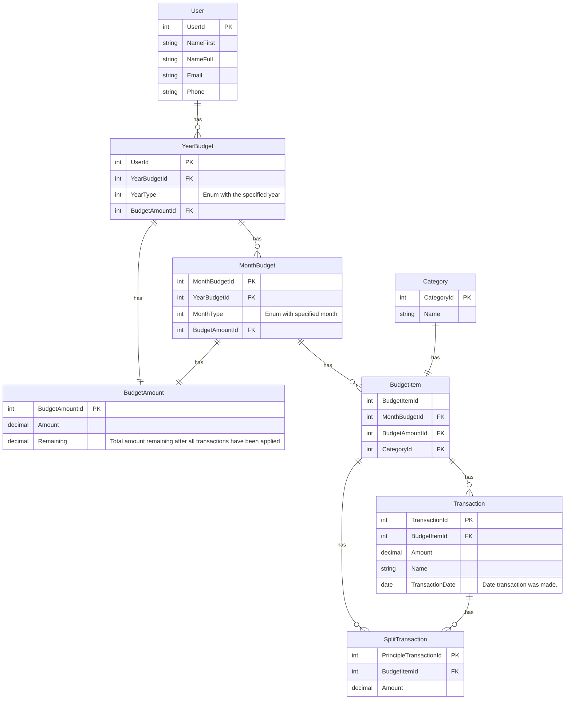

# FarmersOnlyBudget
Farmers only budget is a budgeting application that is meant to replace applications like EveryDollar.com and RocketMortgage.com. This application is not meant for broad commercial use, however, based on the application's state and services in the distant future, the application could be placed in the open market. For the near future, this application will remain as an application solely for the developer to use.

# Technical Aspects

The technical design of this application is pretty straight forward, with few extremely advanced features - the most advanced feature being decimal arithmetic precision, and sockets (ASP.NET Core SignalR). This application will be built with the following major technologies.

| **Technologies** | Version |
| ---------------- | ------- |
| ASP.NET Core     | .NET 8  |
| Postgres SQL     | v17.1   |
| Angular          | v18.0   |
| REST             | n/a     |
## Database Design

The application will use PostgresSQL for all database operations - may incorporate SQLite if there is a need for a runtime level database, but that is unlikely. The database will have several tables pertaining to users, budgeting years/months, budget line items, and transactions. The initial schema is simplistic in nature, and should not be too complex to configure and use. However, revisions may be needed as development progresses.

The database design is as follows.

